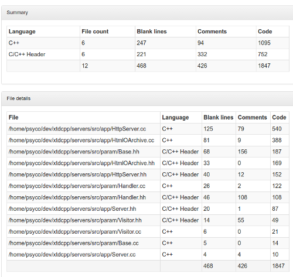
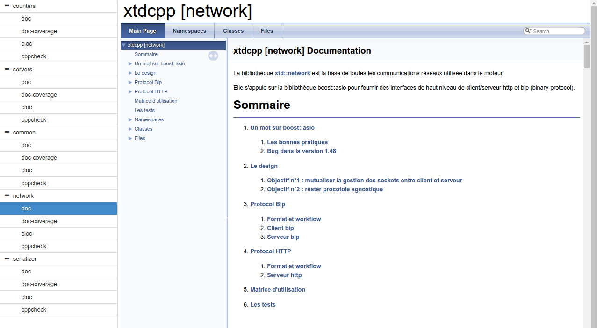

<!-- markdown-toc start - Don't edit this section. Run M-x markdown-toc-generate-toc again -->
**Table of Contents**

- [What is it ?](#what-is-it-)
- [Install](#install)
- [Features](#features)
    - [Binary identity tracking](#binary-identity-tracking)
    - [Building both shared and static library](#building-both-shared-and-static-library)
    - [Code quality reports](#code-quality-reports)
        - [Documentation](#documentation)
        - [Documentation Coverage](#documentation-coverage)
        - [Count lines of code](#count-lines-of-code)
        - [Cppcheck static analysis](#cppcheck-static-analysis)
        - [Unit tests](#unit-tests)
        - [Unit tests code coverage](#unit-tests-code-coverage)
        - [Report Interface](#report-interface)

<!-- markdown-toc end -->

What is it ?
============

XTDMake is a set of CMake modules that provides easy-to-use targets that generate
code quality measurements reports

Install
=======

0. Prerequisites
  ```bash
  # Doxygen (Generate documentation from source code)
  sudo apt-get install doxygen

  # Dot (Generate pictures from graphs)
  sudo apt-get install graphviz

  # xsltproc (Transform XML files from XSLT stylesheets)
  sudo apt-get install xsltproc

  # lcov (Generate HTML results from code-coverage informations)
  sudo apt-get install lcov

  # coverxygen (Generate documentation-coverage informations from doxygen documentation)
  sudo pip3 install coverxygen

  # cloc (Count line of codes)
  sudo apt-get install cloc

  # cppcheck (C++ static code analysis tool)
  sudo apt-get install cppcheck
  ```

1. Download latest release xtdmake archive
  ```bash
  wget "https://github.com/psycofdj/xtdmake/archive/<version>.tar.gz"
  ```

2. Uncompress archive in your project's root
  ```bash
  tar xvzf <version>.tar.gz
  ```

3. Load XTDMake in your project's root CMakeLists.txt
  ```cmake
  include(xtdmake/loader.cmake)
  ```

# Features

## Binary identity tracking

This feature configures your C/C++ build to add information about when and how your
binaries were constructed. Behind the scene, cmake will wrap your linker to add a
ident-compatible string to your binary. In addition, cmake will add this kind of
informations when generating static archives (.a files) and use them when linking your
binaries.

Demo:

```bash
# compile our binary (which links to libcommon_s)
make common_tf

# extract informations from generated file
ident common_tf

# output result
common_tf:
$date: 16-08-2016 $
$time: 10:43:15 $
$name: common_tf $
$user: psyco $
$host: xmarcelet $
$pwd: /home/psyco/dev/xtdcpp/.release/common $
$revno: 98b7d3e224e9ad32affab425c52bfe19f2ce302d $
$archive: [libcommon_s] (time) 10:43:12 $
$archive: [libcommon_s] (date) 16-08-2016 $
$archive: [libcommon_s] (revno) 98b7d3e224e9ad32affab425c52bfe19f2ce302d $
```


This feature can be enabled by adding the following directive to your project's root
CMakeLists.txt :
```cmake
find_package(Tracking REQUIRED)
```

## Building both shared and static library

XTDMake provides a way to easily produce both static and shared library from a single
call. In addition it will optimize your build to produce only one set of object files
that will be used for both targets.

Note: This means that objects generated with -fPIC are used to create static archives.
This may have a performance impact.

```cmake
 # in CMakeLists.txt
add_shared_static_library(<library_name> <file1> <file2> ....)
```

This will create two CMake targets :
 - `<library_name>`   : that will produce `lib<library_name>.so`
 - `<library_name>_s` : that will produce `lib<library_name>_s.a`

You may customize theses target at will using standard CMake functions.


In order to use `add_shared_static_library` function, you must load the StaticShared
module by adding the following directive too your project's root CMakeLists.txt :
```cmake
find_package(StaticShared REQUIRED)
```

## Code quality reports

XTDMake provides a bunch of modules producing code quality measurements targets.


Each target generates both a locally consultatble and machine processable reports.
Local report targets the developer while the machine-processable reports can be
used in your Continuous Integration (CI) process.


Note about CI :

Key Points Indicators (KPIs) measurement tools are often built in the CI
work flow and therefore cannot be run on the developer's local environment.
This usually lead to discovering regressions (failed tests, a lower coverage
or what-so-ever) only after pushing code to distant repository.
Developer's being responsible for the KPIs, they should be able to
run the measurement tools before pushing new code.


Because industrial applications' code is usually segmented designed in different module,
with a different purpose and levels of criticity, XTDMake's KPIs reports are
generated per module, allowing a finer interpretation of the indicators.


C++ compilation being already slow enough, XTDMake's code-measurement targets are
designed to be fully incremental with a fine dependency tracking.


### Documentation

This target generate documentation with doxygen.

Default configuration file template is shipped with XTDMake (xtdmake/doc/doxygen.in).

1. In your project's root CMakeLists.txt :
  ```cmake
  find_package(Doc REQUIRED)
  ```

2. In your module's CMakeLists.txt :
  ```cmake
  add_doc(<module_name>)
      [ EXCLUDE file1 file2 ... ]
      [ WERROR ])
  ```

3. Generate the reports :
  ```bash
  # generate documentation for a specific module
  make -C <module_path> doc-<module_name>

  # generate documentation for all modules
  make doc

  # remove generated documentation
  make doc-clean
  ```

4. Consult the report  :
  ```
  sensible-browser ./reports/<module_name>/doc/html/index.html
  ```

  Note that it will also produce an xml version of the documentation in :
  ```
  ./reports/<module_name>/doc/xml/index.xml
  ```


### Documentation Coverage

This target will generate a report showing how complete is documentation.


1. In your project's root CMakeLists.txt :
  ```cmake
  # note that this depends on Doc module
  find_package(DocCoverage REQUIRED)
  ```

2. In your module's CMakeLists.txt :
  ```cmake
  add_doc_coverage(<module_name>)
  ```

3. Generate the reports :
  ```bash
  # generate documentation-coverage for a specific module
  make -C <module_path> doc-coverage-<module_name>

  # generate documentation coverage for all modules
  make doc-coverage

  # remove generated report
  make doc-coverage-clean
  ```

4. Consult the report  :
  ```
  sensible-browser ./reports/<module_name>/doc-coverage/index.html
  ```

  Note that it will also produce an json version of the report in :
  ```
  ./reports/<module_name>/doc-coverage/data.json
  ```

  Output :
  
  


### Count lines of code

This target generates a report counting the number of code, blank and comments lines
of your module.

1. In your project's root CMakeLists.txt :
  ```cmake
  find_package(Cloc REQUIRED)
  ```

2. In your module's CMakeLists.txt :
  ```cmake
  add_cloc(<module_name>)
  ```

3. Generate the reports :
  ```bash
  # generate cloc for a specific module
  make -C <module_path> cloc-<module_name>

  # generate cloc for all modules
  make cloc

  # remove generated report
  make cloc-clean
  ```

4. Consult the report  :
  ```
  sensible-browser ./reports/<module_name>/cloc/index.html
  ```

  Note that it will also produce an xml version of the report in :
  ```
  ./reports/<module_name>/cloc/index.xml
  ```

  Output :
  


### Cppcheck static analysis


Cppcheck is a static C++ code analyzer tool. This target will produce a report of
cppcheck output.

1. In your project's root CMakeLists.txt :
  ```cmake
  find_package(Cppcheck REQUIRED)
  ```

2. In your module's CMakeLists.txt :
  ```cmake
  add_cppcheck(<module_name>)
  ```

3. Generate the reports :
  ```bash
  # generate cloc for a specific module
  make -C <module_path> cppcheck-<module_name>

  # generate cloc for all modules
  make cppcheck

  # remove generated report
  make cppcheck-clean
  ```

4. Consult the report  :
  ```
  sensible-browser ./reports/<module_name>/cppcheck/index.html
  ```

  Note that it will also produce an xml version of the report in :
  ```
  ./reports/<module_name>/cppcheck/index.xml
  ```

  Output :
  


### Unit tests

TBD

### Unit tests code coverage

TBD

### Report Interface

In order to make all these reports as accessible as possible, XTDMake provides a
little locally consultatble web interface that helps the developer to navigate
through all generated reports.


1. In your project's root CMakeLists.txt :
  ```cmake
  find_package(Reports REQUIRED)
  ```

3. Generate the reports :
  ```bash
  # generate all reports
  make reports

  # open the web interface
  make reports-show

  # delete all reports
  make reports-clean
  ```

  Output :
  

<!--  LocalWords:  ident libcommon tf pwd revno affab bfe ce xtdmake
 -->
<!--  LocalWords:  StaticShared WERROR DocCoverage Cloc cloc Cppcheck
 -->
<!--  LocalWords:  cppcheck
 -->
